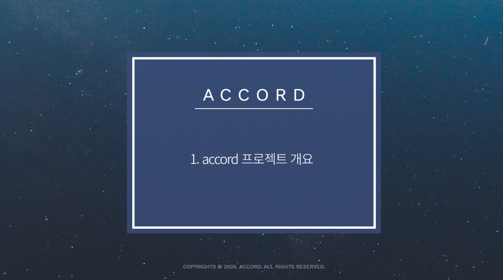
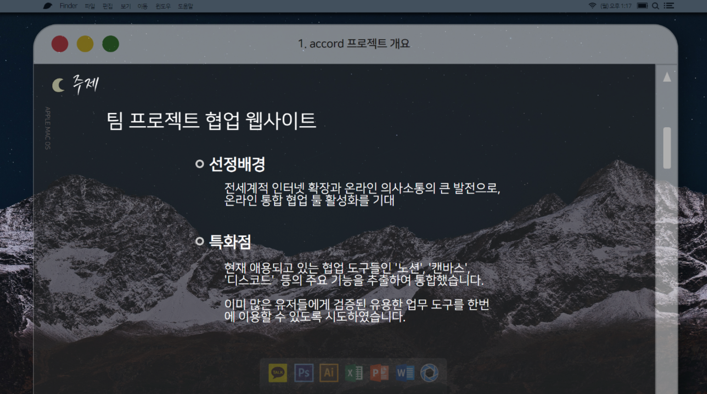
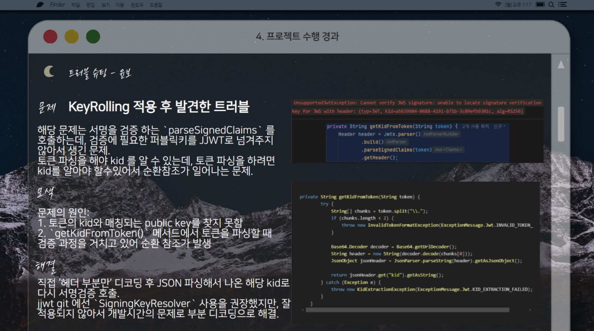

# 4차 프로젝트 - **Accord 팀프로젝트 (accord team project)**

## 💡 팀(팀명:no-team-name) 프로젝트

 

### 개발자들을 위한 온라인 협업툴!
### 피그마/디스코드/노션 따로사용하세요?
### ACCORD 하나로 협업해요!  

 

- 메인 페이지: https://accord.my/ (현재는 운영이 닫힌 상태)

  

---
### 리포지터리 링크

* **소개 링크 :** https://github.com/yoda-yoda/Project4_accord-overview
* **backend (spring) :** https://github.com/yoda-yoda/Project4_accord-backend
* **frontend (react) :** https://github.com/yoda-yoda/Project4_accord-frontend
* **api-gateway :** https://github.com/yoda-yoda/Project4_accord-api-gateway
* **go-backend :** https://github.com/yoda-yoda/Project4_accord-go-backend
* **signaling server :** https://github.com/yoda-yoda/Project4_accord-signaling-server
* **turn server :** https://github.com/yoda-yoda/Project4_accord-turn-server
* **stun server :** https://github.com/yoda-yoda/Project4_accord-stun-server 

  

---

## 개요

 ppt 이미지로 보기 

 

[▲개요로 스크롤](#개요)

  

 글로 보기 

# 4차 프로젝트 - **Accord 팀프로젝트 (accord team project)**

## 💡 팀(팀명:no-team-name) 프로젝트

 

 

### 주제
- 애용되는 협업 도구들인 '노션', '캔바스', '디스코드' 등의 주요 기능을 추출하여 하나의 웹사이트로 통합하였습니다.

- Ai채팅, 음성대화, 노트, 캔버스, 팀채팅, 칸반보드, 게시판 등 업무와 협업에 편리한 도구를 한번에 구성하였습니다.

- 이미 많은 유저들에게 검증된 유용한 업무 도구를 한번에 이용할 수 있도록 시도하였습니다.

 

### Accord의 의미  
- **accord =>** 영단어로 일치한다는 의미를 갖습니다.
  온라인의 유용한 협업 도구들을 웹사이트 하나에 일치시켜 올인원 협업 플랫폼이 되었다는 뜻을 가집니다.

  

---

## 🌟 주요 기능

 

### 1. 회원 관리
   - 소셜 로그인(Google, Naver, Kakao) 기반 OAUTH 2.0 + JWT 인증  
   - 최초 로그인 시 자동 회원가입 처리, 이메일 중복 불가  
   - 닉네임(중복 제한), 프로필 이미지(S3 저장, 전처리 포함) 설정 가능  
   - 로그아웃 및 회원탈퇴 지원  

### 2. 팀 꾸리기  
   - 유저가 팀을 생성하고 팀별 메뉴(노트, 캔버스, 칸반보드, 보이스, 채팅)를 선택  
   - 협업 중심의 다양한 도구 제공  

### 3. 팀 노트 
   - 마크다운 기반 협업 문서 작성 (노션 유사 기능)  

### 4. 팀 캔버스
   - 협업 화이트보드: 그림 그리기, 사진 첨부, 도형 추가, 텍스트 편집 가능  

### 5. 팀 보이스
   - 팀원 간 실시간 음성 채팅 기능  

### 6. 칸반보드
   - 팀 업무 관리 보드  
   - 컬럼 및 카드 단위로 CRUD 가능  

### 7. 팀 채팅  
   - 팀별 실시간 텍스트 채팅 기능  

### 8. 팀원 구인 게시판
   - 팀원 모집을 위한 게시판  
   - 글 작성, 수정, 삭제, 댓글 CRUD 지원  

### 9. Ai 채팅
   - AI(Chatbot)과 실시간 대화  
   - 팀 협업에 필요한 정보 질의응답 가능  

### 10. 관리자
   - 회원 관리: 계정 활성화, 차단, 삭제(소프트 딜리트 포함), 작성 게시글 관리  
   - 대시보드: 사용자 활동 통계 확인 (실시간·기간별)  
   - Prometheus API로 데이터 수집, Grafana로 시각화

  

---

## 🚀**개발 환경**

 

- ### 아키텍처

   

- ### **ERD 1(Spring)**

  

- ### **ERD 2(Go)**

  

- ### **플로우 차트**

  

- ### **활용 기술**

  
  
  
  
  
  
  
  
  
  
  
  
  
  
  
  
  
  
  
  
  
  
  
  
  

 
 

   

---

## 🤝 팀 구성 및 역할

 

| 이름   | 역할 | 공통 | 주요 |
|--------|------|------|------|
| 박유빈 | 팀장 | ERD/Figma/Flowchart 설계 |  **#주요 업무** - API Gateway 개발 - STUN, TURN 서버 개발 - Signaling 서버 개발 - GO 백엔드 서버 개발 - 몽고DB 및 Redis 구성 - CI/CD 구성 - React 프론트엔드 개발 - 기술 공유 및 일정 조율 |
| 이시현 | 팀원 | ERD/Figma/Flowchart 설계 |  **#주요 업무** - S3를 통한 프로필 이미지 CRUD 기능 개발 - RabbitMQ를 통한 채팅 기능 개발 - React 프론트 UI 제작 |
| 심윤보 | 팀원 | ERD/Figma/Flowchart 설계 |  **#주요 업무** - OAuth2.0 로그인 개발 - JWT 키롤링 기능 개발 - Spring 백엔드 gRPC 클라이언트 개발 - 관리자 기본기능 개발 - React 프론트 UI 제작 |
| 정석환 | 팀원 | ERD/Figma/Flowchart 설계 |  **#주요 업무** - SMTP 메일링 서비스를 이용한 팀 초대 기능 개발 - 팀프로젝트 칸반보드 기능 개발 - React 프론트 UI 제작 |
| 최요셉 | 팀원 | ERD/Figma/Flowchart 설계 |  **#주요 업무** - 프로젝트 팀 구성 개발 - 팀원 모집 게시판 CRUD 기능 개발 - 팀원 모집 게시판 댓글 관련 기능 개발 - React 프론트 UI 제작 |

   

---

## 📅 프로젝트 수행 절차 및 일정

 

### Week 1 (01/08 ~ 01/11) | 기획 및 설계
- **01/08**  
  - 아이디어 기획 및 주요 기술 스택, 아키텍처 설계
- **01/09**  
  - 세부 요구사항 분석 및 확정, Git 세팅 및 프로젝트 생성
- **01/10**  
  - DB 모델링 및 ERD 설계, API 설계 초안 작성, MVP 기준 핵심 기능 목록 확정
- **01/11**  
  - 1차 점검 (설계 완료 검토 및 피드백 반영)
  - [FRONT] 팀 노트 기능 추가
  - [TURN] 턴 서버 추가

---

### Week 2 (01/13 ~ 01/17) | 핵심 기능 개발 (1차)
- **01/13**  
  - 기본 인증 및 권한 관리 기능 개발 (JWT, OAuth 등)  
  - [SPRING BACKEND] API 기본 기능 개발 (CRUD)  
  - [GO] note CRUD 기능 개발
- **01/16**  
  - [FRONT] Header 및 Sidebar UI 구조 개선
- **01/18**  
  - [SPRING BACKEND] 데이터 저장 및 조회 기능 구현 (DB 연동)
- **01/19**  
  - [SPRING BACKEND] 프로필 이미지파일 업로드 기능 개발 (AWS S3 연동)

---

### Week 3 (01/20 ~ 01/24) | 핵심 기능 개발 (2차) & UI 연동
- **01/20**  
  - [SPRING BACKEND] 비동기 처리 로직 적용 (RabbitMQ 활용)
- **01/21**  
  - 2차 점검 (기본 기능 구현)
- **01/22**  
  - [FRONT] 프로필 업로드 기능 및 UI 추가  
  - API 확장 및 응답 최적화
- **01/23**  
  - 클라이언트와 API 연동 시작
- **01/24**  
  - [SPRING BACKEND] API-GATEWAY 설정  
  - 주요 화면 UI 개발 (React 등)  
  - WebSocket, 실시간 알림 기능 추가

---

### Week 4 (01/27 ~ 01/31) \[2025년 설 연휴\] | 기능 확장 및 최적화
- **01/28**  
  - 3차 점검 (핵심 기능 및 UI 검토)
- **01/29**  
  - 성능 개선  
  - 예외 처리 및 로깅 시스템 개선
- **01/30**  
  - 캐싱 및 성능 최적화 (Redis, Query 튜닝)
- **01/31**  
  - 보안 검토 및 조치 (CORS, CSRF, SQL Injection 대응)

---

### Week 5 (02/03 ~ 02/07) | 테스트 및 배포
- **02/01**  
  - 관리 도구 개발 (관리자 페이지 등)
- **02/02**  
  - E2E 테스트(End-to-End) 진행
- **02/03**  
  - 운영 환경 구성 (서버 배포 준비)
- **02/04**  
  - 4차 점검 (운영 준비 검토)
- **02/05**  
  - [FRONT] Kanban Board 기능 구현  
  - [FRONT] Footer 디자인 개선 및 편의성 최적화  
  - [FRONT] 댓글 기능 개발
- **02/06**  
  - 사용자 피드백 수집 및 개선
- **02/07**  
  - 긴급 버그 수정 및 최적화
- **02/08**  
  - Beta 버전 최초 배포
- **02/09**  
  - 편의성 개선 패치 배포

---

### Week 6 (02/10 ~ 02/11) | 안정화
- **02/10**  
  - 최종 점검 및 안정화  
  - 발표자료 작성
- **02/11**  
  - 정식 배포  
  - 프로젝트 완료

 

   

---

## 📝 API 명세

 

  API 명세서 Swagger version

  

  

 

## 팀관리 (위임 및 권한 관련 API)

| Method | Endpoint                                        | Description                   |
|--------|-------------------------------------------------|-------------------------------|
| **GET**    | `/api/teams/{teamId}`                             | 팀 조회                        |
| **PUT**    | `/api/teams/{teamId}`                             | 팀 이름 수정                    |
| **DELETE** | `/api/teams/{teamId}`                             | 팀 삭제                        |
| **POST**   | `/api/members/teams`                              | 팀 생성                        |
| **POST**   | `/api/members/teams/members/{teamId}`             | 팀에 구성원 등록                |
| **GET**    | `/api/members/teams/{memberId}`                   | 특정 회원의 팀 목록 조회         |
| **GET**    | `/api/members/team-members/{teamId}/{memberId}`    | 팀원 상세 조회 또는 초대 확인       |
| **GET**    | `/api/members/team-members/search`                 | 팀 멤버 검색                    |

---

## 조인보드 (가입 게시판) API

| Method | Endpoint                  | Description                 |
|--------|---------------------------|-----------------------------|
| **GET**    | `/api/join-board/{joinBoardId}`      | 가입 게시판 게시글 상세 조회        |
| **PUT**    | `/api/join-board/{joinBoardId}`       | 게시글 수정                         |
| **DELETE** | `/api/join-board/{joinBoardId}`       | 게시글 삭제                         |
| **GET**    | `/api/join-board`                     | 가입 게시판 전체 게시글 조회        |
| **POST**   | `/api/join-board`                     | 게시글 생성                         |
| **POST**   | `/api/join-board/search`              | 게시판 내 글 검색                   |
| **GET**    | `/api/join-board/sort-by=title`       | 게시글 제목 기준 정렬 조회            |

### 댓글(코멘트) 관련

| Method | Endpoint                | Description         |
|--------|-------------------------|---------------------|
| **PUT**    | `/api/comment/{commentId}`        | 댓글 수정            |
| **DELETE** | `/api/comment/{commentId}`        | 댓글 삭제            |
| **GET**    | `/api/comment/{joinBoardId}`      | 댓글 조회            |
| **POST**   | `/api/comment/{joinBoardId}`      | 댓글 작성            |
| **GET**    | `/api/joinBoard/{joinBoardId}/comment/{commentId}` | 특정 댓글 또는 대댓글 조회 |

---

## 회원정보관리 (닉네임 변경 및 회원정보 조회 API)

| Method | Endpoint                      | Description         |
|--------|-------------------------------|---------------------|
| **PATCH** | `/api/member/nicknames`          | 닉네임 변경            |
| **GET**    | `/api/member/userinfos`          | 회원(유저) 정보 조회     |
| **GET**    | `/api/member/profiles`           | 회원 프로필 조회         |

---

## 팀 캔버스 (파일 업로드 등) API

| Method | Endpoint                  | Description             |
|--------|---------------------------|-------------------------|
| **POST**   | `/api/images/canvases`        | 캔버스 파일 업로드(저장)  |
| **GET**    | `/api/images/canvases`         | 캔버스 파일 조회           |
| **DELETE** | `/api/images/canvases`         | 캔버스 파일 삭제           |

---

## 관리자(Admin) API

| Method | Endpoint                                         | Description        |
|--------|--------------------------------------------------|--------------------|
| **PUT**    | `/api/admin/members/{memberId}/status`           | 회원 상태 변경        |
| **GET**    | `/api/admin/members/search`                      | 회원 검색            |
| **GET**    | `/api/admin/boards/{boardId}/boards`             | 특정 보드(게시글) 조회 |
| **DELETE** | `/api/admin/boards/{boardId}`                    | 보드(게시글) 삭제     |
| **DELETE** | `/api/admin/boards/{boardId}/ban`                | 게시글 차단, 제재     |

---

## 프로필이미지 (Profile Image) API

| Method | Endpoint                          | Description         |
|--------|-----------------------------------|---------------------|
| **POST**   | `/api/members/profile-images`      | 프로필 이미지 등록    |
| **DELETE** | `/api/members/profile-images`      | 프로필 이미지 삭제    |

---

## 채팅 API

| Method | Endpoint             | Description        |
|--------|----------------------|--------------------|
| **POST**   | `/api/chat/messages`     | 채팅 메시지 전송하기    |

---

## 팀 노트 API

| Method | Endpoint              | Description  |
|--------|-----------------------|--------------|
| **POST**   | `/api/members/notes`        | 팀 노트 생성      |
| **DELETE** | `/api/members/notes`        | 팀 노트 삭제      |

---

## 인증 관리 (JWT/토큰 등)

| Method | Endpoint             | Description         |
|--------|----------------------|---------------------|
| **POST**   | `/api/auth/reissue`    | 토큰 재발급          |
| **POST**   | `/api/auth/logout`     | 로그아웃              |
| **DELETE** | `/api/auth`            | 회원 탈퇴 혹은 인증 취소 |

---

## 칸반보드 (Kanban Board) API

| Method | Endpoint                          | Description                     |
|--------|-----------------------------------|---------------------------------|
| **PUT**    | `/api/kanbanboardcard/update`     | 카드 내용 변경                    |
| **PUT**    | `/api/kanbanboard/update`         | 칸반보드(보드) 수정               |
| **POST**   | `/api/kanbanboardcard/switch`     | 카드 스위치(컬럼 간 이동 등)       |
| **POST**   | `/api/kanbanboardcard/create`     | 카드 생성                         |
| **POST**   | `/api/kanbanboard/switch`         | 칸반보드 스위치                  |
| **POST**   | `/api/kanbanboard/create`         | 칸반보드 생성                     |
| **GET**    | `/api/kanbanboard/{teamId}`       | 칸반보드 조회                     |
| **DELETE** | `/api/kanbanboardcard/delete`     | 카드 삭제                         |
| **DELETE** | `/api/kanbanboard/delete`         | 칸반보드 삭제                     |

---

[▲개요로 스크롤](#개요)

     

